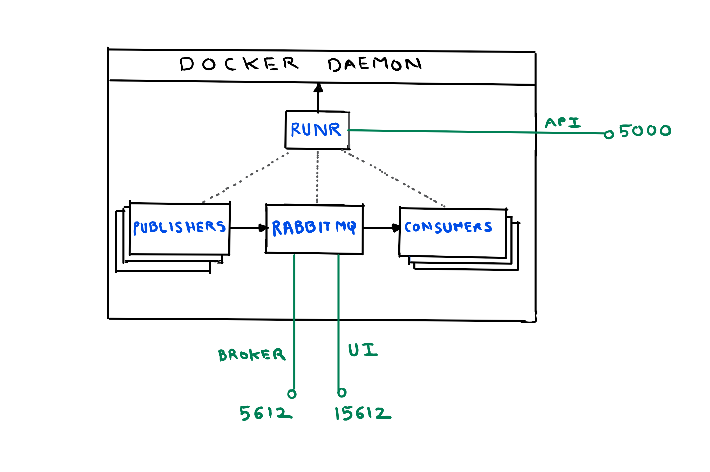

# Rabbit Runr



RabbitRunr is a tool for quickly setting up a rabbitmq broker, message publishers and consumers. This tool was created to observe rabbitmq's behavior (mainly flow control) under different load and memory conditions. RabbitRunr runs everything (rabbitmq, publisher and consumer) in separate docker containers.

### Pre-requisites
[Docker for Mac](https://store.docker.com/editions/community/docker-ce-desktop-mac) OR [Docker on any linux distribution](https://docs.docker.com/engine/installation/#prior-releases).

Note: Support for Docker on Windows coming soon.

### Quick start  
#### start rabbitrunr and rabbitmq broker

Run the [rabbitrunr](rabbitrunr) file from terminal

This will start runr which will in turn create a container running rabbitmq broker and allocate 500MB memory. "rbmq-memory" setting can be very useful to simulate blocked connections quickly.

#### create publishers, queues and consumers
```
curl -X POST -d '{"device-count": 10, "message-size": "1MB"}' http://machine-ip:5000/runr
```
At this point 10 publishers will start publishing messages, size 1MB each, to 10 different queues. Consumers are created but not started yet.

Note: If message size is not provided, default message size of 1KB will be used. Max message size supported is 1MB.

#### start/stop consumer and publisher
Publishers and consumers are named after the queues that they communicate with. So if the queue name is "xyz", its publisher and consumer container will be named "runr-publisher-xyz" and "runr-consumer-xyz" respectively. To start or stop a publisher or consumer related to a queue, you only need to pass the queue name and type as shown below:
```
curl -X POST -d '{"runr-type":"publisher", "queue-name": "<queue-name-here>"}' http://machine-ip:5000/start

curl -X POST -d '{"runr-type":"publisher", "queue-name": "<queue-name-here>"}' http://machine-ip:5000/stop

curl -X POST -d '{"runr-type":"consumer", "queue-name": "<queue-name-here>"}' http://machine-ip:5000/start

curl -X POST -d '{"runr-type":"consumer", "queue-name": "<queue-name-here>"}' http://machine-ip:5000/stop
```
#### view logs
Runr and publisher logs are the most important here. Runr logs will log the containers created and settings applied. Publisher logs will have notifications (cancel, connection closed, channel closed, flow control, connection blocked etc) from RabbitMQ broker logged. 
```
To view list of all containers:
docker ps -a

To view logs of a container:
docker logs <container-name> / <container-id>

To follow logs of a container:
docker logs -f <container-name> / <container-id>
```

#### Todo
[Planned work](https://github.com/vishal-uttamchandani/rabbitrunr/projects/1)